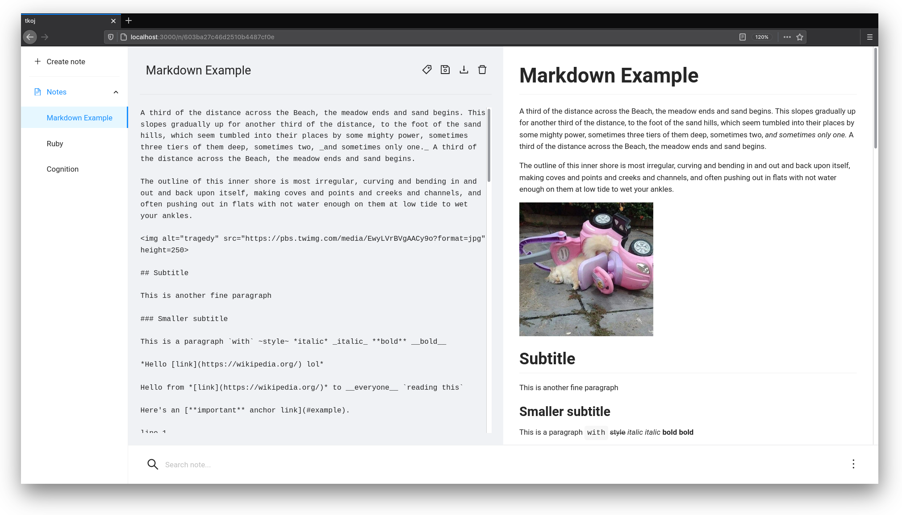

<div align='center'>
  <h1>TKOJ</h1>
</div>

Simple markdown editor with live preview

I built this essentially to further my knowledge on **React**, **Hooks** and the **Context API**

The name was supposed to be an acronym but I ended up building something different and could not think of anything better



### Features

- JWT based authentication
- CRUD notes
- Markdown live preview
- Account settings
- Note searcher
- Notes download
- Responsive UI for smaller screens
- UI error feedback


## Usage

Env file for the server must be on the `server` directory and have the next variables

```dosini
PORT=3001
MONGODB_URI="Your mongodb server URI"
JWT_SECRET="Your JWT secret key"
```

#### Requirements:

- Node.js
- npm
- Make
- Mongodb

Make commands:

- `make install` to fetch the server and the client dependencies
- `make server` to initialize the server
- `make client` to initialize the client
- `make clean` to remove the dependencies of the server and the client

## Build with

- [React](https://reactjs.org/)
- [Ant Design](https://ant.design/)
- [Express](http://expressjs.com/)
- [MongoDB](https://www.mongodb.com/)
